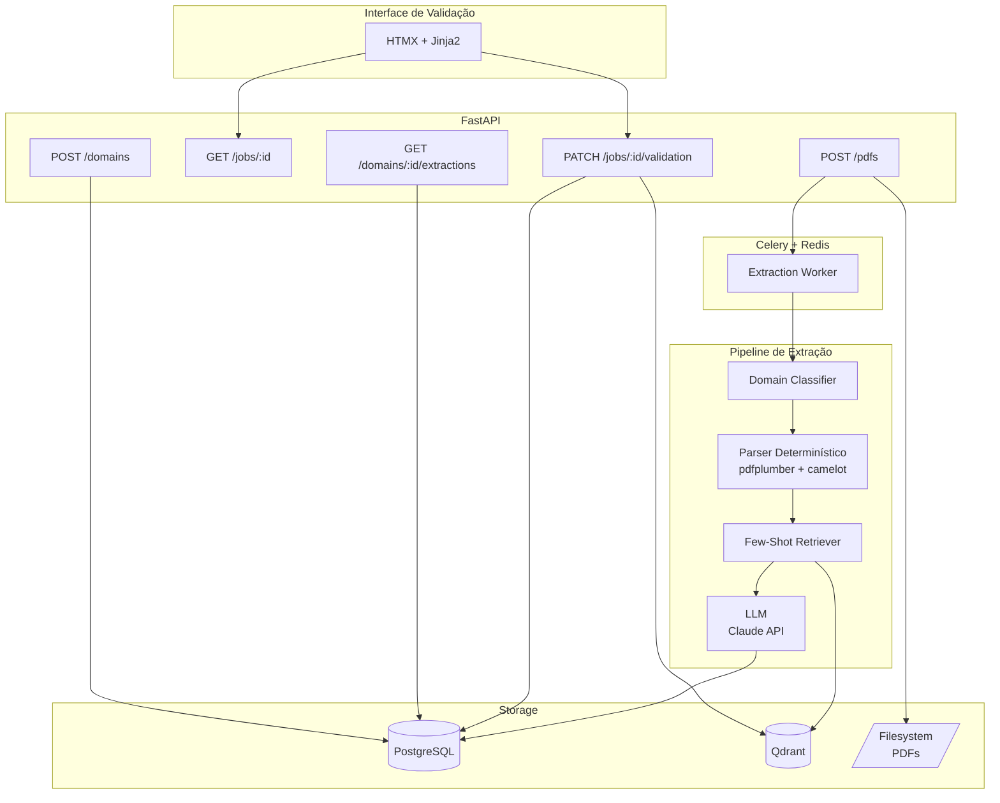
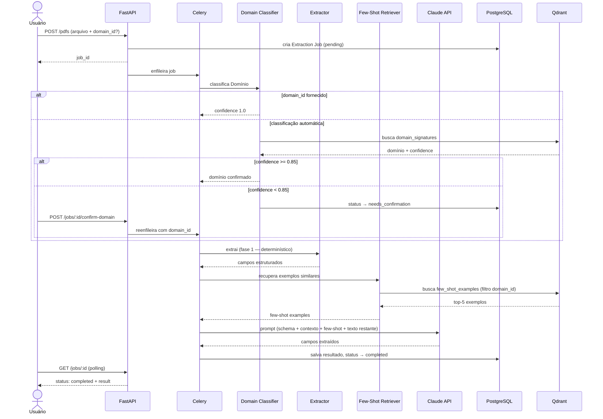
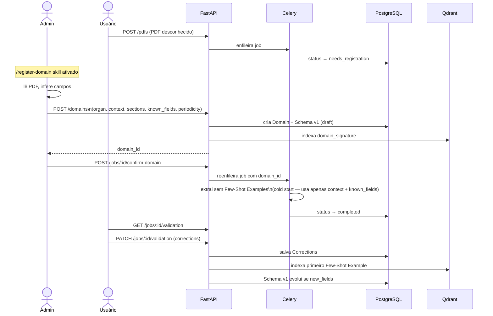
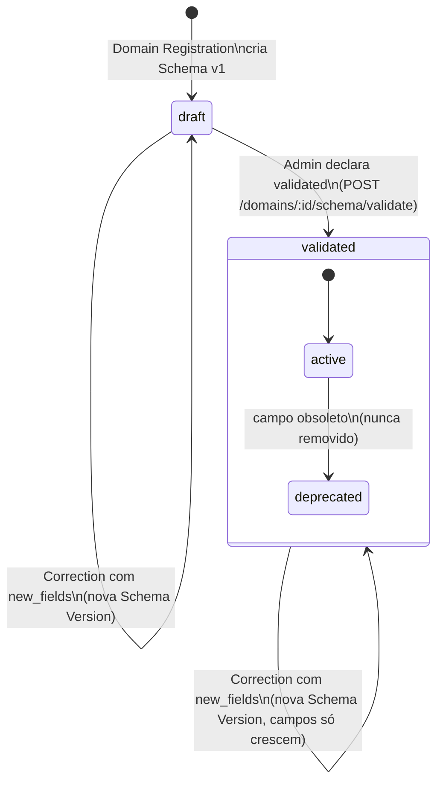
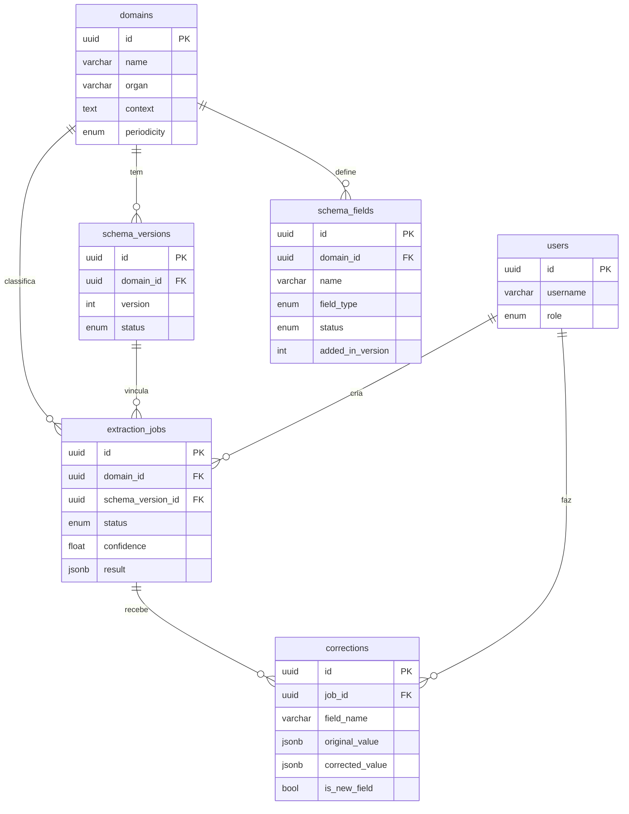

# Update Living Documentation

Regenera `docs/ARCHITECTURE.md` com diagramas Mermaid e descrições de fluxo refletindo o estado atual do projeto.

---

## Quando executar este skill

- Após adicionar ou remover um endpoint
- Após criar ou modificar um componente
- Após uma mudança no data model
- Após uma nova decisão arquitetural (ADR)
- Antes de um code review ou onboarding de novo membro

---

## Passo 1 — Ler o estado atual do projeto

Antes de escrever qualquer coisa, leia:

```
CONTEXT.md                        → glossário e termos canônicos
docs/specs/api.md                 → endpoints atuais
docs/specs/components.md          → componentes e responsabilidades
docs/specs/data-model.md          → tabelas e coleções
docs/adr/                         → decisões arquiteturais
src/                              → estrutura real do código (se existir)
```

Se o código divergir dos specs, **o código é a fonte da verdade**. Atualize o diagrama para refletir o que o código faz, e anote a divergência como um comentário no ARCHITECTURE.md para revisão posterior.

---

## Passo 2 — Gerar os diagramas

Escreva ou atualize cada diagrama abaixo. Use os **termos exatos do CONTEXT.md** — nunca sinônimos.

### Diagrama 1 — Visão geral do sistema



### Diagrama 2 — Fluxo principal de extração



### Diagrama 3 — Cold start (novo Domínio)



### Diagrama 4 — Ciclo de vida do Schema



### Diagrama 5 — Modelo de dados (simplificado)



---

## Passo 3 — Escrever as descrições de fluxo

Para cada fluxo, escreva um parágrafo curto **abaixo do diagrama** explicando:
- O que dispara o fluxo
- A decisão mais importante no meio do caminho
- O que indica que terminou com sucesso

Use os termos do CONTEXT.md. Sem jargão técnico desnecessário.

---

## Passo 4 — Montar o ARCHITECTURE.md

Estrutura do arquivo final:

```markdown
# Arquitetura — PDF Extractor

> Última atualização: {data}

## Stack

| Camada | Tecnologia |
...

## Visão Geral
{diagrama 1}
{descrição}

## Fluxo de Extração
{diagrama 2}
{descrição}

## Cold Start — Novo Domínio
{diagrama 3}
{descrição}

## Ciclo de Vida do Schema
{diagrama 4}
{descrição}

## Modelo de Dados
{diagrama 5}
{descrição}

## Decisões Arquiteturais
Links para docs/adr/ com uma linha de contexto cada.
```

---

## Passo 5 — Verificar consistência

Antes de salvar, confirme:

- [ ] Todos os componentes no diagrama existem em `docs/specs/components.md`
- [ ] Todos os endpoints no diagrama existem em `docs/specs/api.md`
- [ ] Todos os termos usados existem no `CONTEXT.md` (sem sinônimos)
- [ ] A data de atualização está correta
- [ ] Se o código existir: nenhum componente no diagrama foi removido do código sem atualização aqui

Se houver divergência entre diagrama e código, adicione ao final do arquivo:

```markdown
## Divergências Conhecidas

- [ ] {componente}: spec diz X, código faz Y — revisar
```
