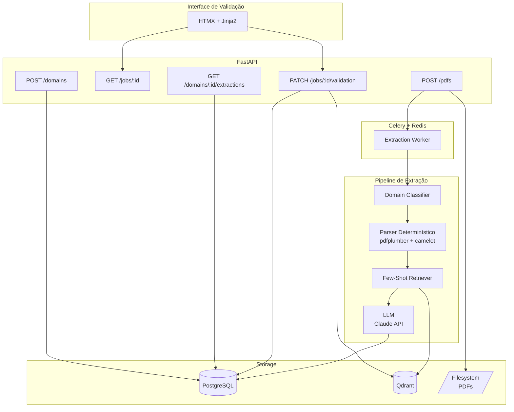
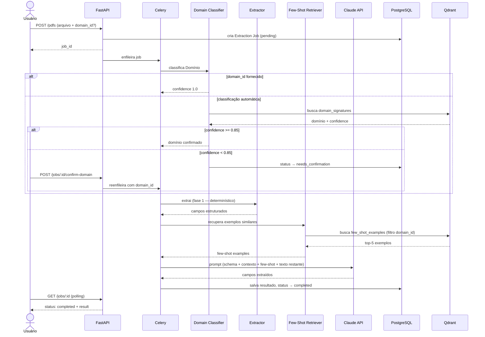
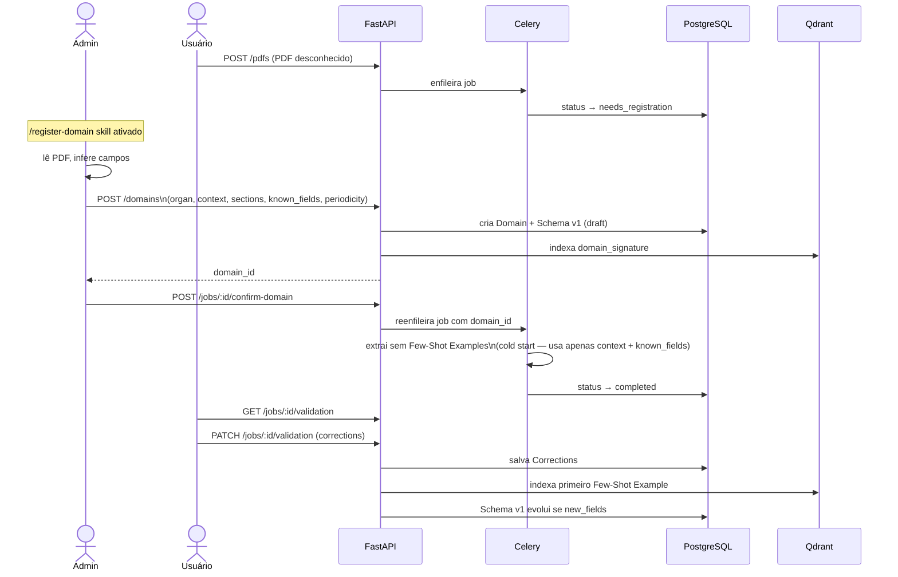
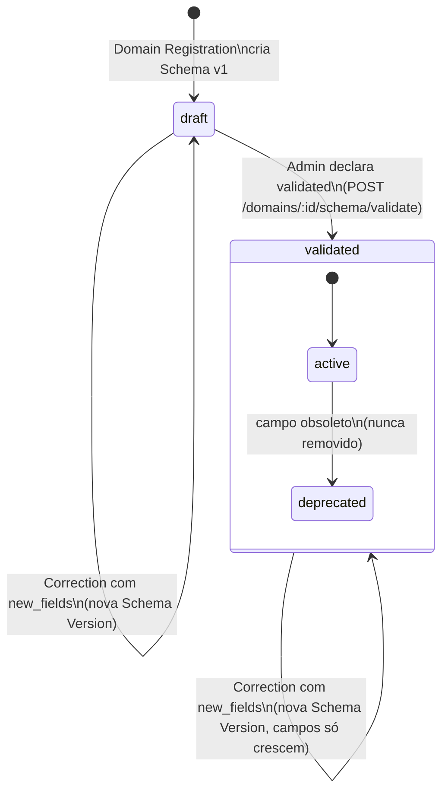
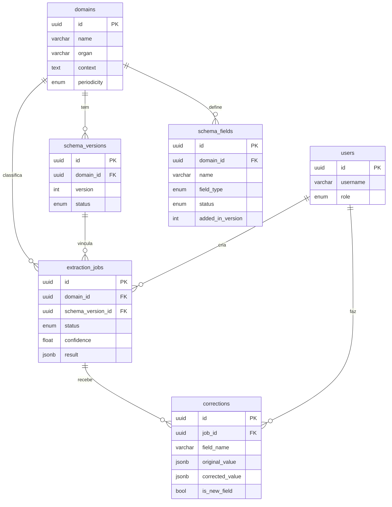

# Arquitetura — PDF Extractor

> Última atualização: 2026-05-28

## Stack

| Camada | Tecnologia |
|---|---|
| API + Frontend | FastAPI + HTMX + Jinja2 |
| Job Queue | Celery + Redis |
| Banco de dados | PostgreSQL + SQLAlchemy + Alembic |
| Vector store | Qdrant |
| Embeddings | sentence-transformers (`neuralmind/bert-base-portuguese-cased`) |
| PDF determinístico | pdfplumber + camelot |
| LLM | Claude API (Anthropic SDK) |
| Infraestrutura | Docker Compose |

---

## Visão Geral

O upload de um PDF dispara um Extraction Job assíncrono no Celery. O Domain Classifier identifica o tipo de relatório e aciona o Extractor híbrido: o parser determinístico cobre campos estruturados, e o LLM (Claude API) cobre o restante usando Few-Shot Examples recuperados do Qdrant por similaridade semântica. O resultado fica disponível para Validation via interface HTMX, e as Corrections alimentam de volta o Qdrant e evoluem o Schema no PostgreSQL.

---

## Fluxo de Extração

Disparado por um upload via `POST /pdfs`. A decisão central é a classificação de Domínio: se a Confidence for alta, o pipeline segue automaticamente; se baixa, o humano confirma antes de prosseguir. O fluxo termina com sucesso quando o job atinge status `completed` e o resultado está disponível para Validation.

---

## Cold Start — Novo Domínio

Ativado quando o Domínio de um PDF não é reconhecido. O admin executa o skill `/register-domain`, que analisa o PDF e propõe os campos do Domain Registration para confirmação. A primeira extração roda sem Few-Shot Examples — usa apenas o contexto registrado. A primeira Validation cria o primeiro Few-Shot Example e esboça o Schema `draft`.

---

## Ciclo de Vida do Schema

O Schema emerge das primeiras extrações de um Domínio e é declarado `validated` explicitamente pelo admin quando está maduro (critério: ≥10 jobs validados, <2 corrections/job, nenhum campo novo recente). Depois de `validated`, campos só são acrescidos — nunca removidos, apenas marcados `deprecated`. Cada mudança de campo cria uma nova Schema Version imutável, e cada Extraction Job fica vinculado à versão ativa no momento de sua execução.

---

## Modelo de Dados

PostgreSQL armazena todos os dados estruturados: usuários, domínios, schemas versionados, jobs e correções. Qdrant mantém duas coleções vetoriais: `domain_signatures` (usada pelo Domain Classifier para identificar novos PDFs) e `few_shot_examples` (usada pelo Few-Shot Retriever para recuperar exemplos por similaridade semântica filtrada por Domínio). PDFs brutos ficam no filesystem local.

---

## Decisões Arquiteturais

| ADR | Decisão | Motivação |
|---|---|---|
| [0001](adr/0001-qdrant-vector-store.md) | Qdrant como vector store | Filtragem por Domínio nativa; pgvector degrada com volume |
| [0002](adr/0002-sentence-transformers-portugues.md) | sentence-transformers PT-BR | Jargão técnico governamental brasileiro; sem custo por chamada |
| [0003](adr/0003-celery-redis-job-queue.md) | Celery + Redis para jobs | Suporte nativo a retries, prioridades e task chaining |
